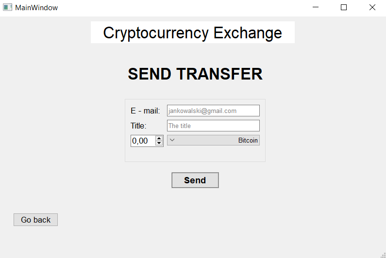

<h1 align="center">
  Cryptocurrency exchange:money_with_wings:
 </h1>
 
## Table of contents
* [About the project](#about-the-project)
* [Features](#features)

## About the project
Final project of Programming classes in fourth semester of Computer Science studies that simulates the behavior of the cryptocurrency exchange. 

The Project is written in the C++ language and uses Qt Creator Environment. I decided to download rates' data from last 3 years of the following cryptocurrencies:
* Bitcoin 
* Ethereum
* Binance Coin
* Tether
* Ripple 

## Features
1. ### Sign In

Sign in panel enables the user to log in to the exchange. If the user doesn't exist in the users' list or if he has entered incorrect data, he will see a proper message.

2. ### Sign Up

Sign up panel enables the user to create an account. I used regular expression to check if the provided data is correct. First and last name can contain only lowercase and capital characters. Email must includes at least 3 letters, then '@' character and the name of the domain. Password must be at least 10 characters long and includes special characters or numbers.

3. ### Main Panel

In that panel, user can see multiple information like:
* Cryptocurrency graphs button 
* My Wallet button 
* Cryptocurrencies rates based on current day in the program
* Date information and *Change date* button

4. ### Change date

After choosing date to change and clicking correct button the date is changed. It automatically changes current rates in the table.

5. ### Cryptocurrency Graphs

The user can see graphs showing the rate for the last 30 days from the current date in program. Every graph is drawn dynamically. Above one shows Bitcoin rate.

6. ### My Wallet Panel

In this section the user can choose the functionality he is interested in from the presented above. He also can see current rates.

7. ### My Cryptocurrency

That section presents user's cryptocurrency in percenteges in the circle diagram. On the right, user sees the particular values of the cryptocurrencies.

8. ### Add money

After choosing that option a user can add any amount of money to the account.

9. ### My orders

In that section the user can make a new order from six available:
* Market Buy
* Market Sell
* Stop Market Buy
* Stop Market Sell
* Stop Limit Buy
* Stop Limit Sell

Every order has it's own features. In addition, the user can delete any order from those already placed - if it's not executed.

10. ### Historical orders

That section presents the list of orders that were executed.

11. ### Orderbook

In the orderbook the user can see other users' orders.

12. ### Send Transfer

When a user wants to send a transfer, he has to enter the following information: recipent's email, the title, cryptocurrency and the amount of money.
If he doesn't have enough money or the recipent doesn't exist, he will get a proper message.

13. ### Transfers history

In that section the user sees history of sent and received transfers. One element presents information of the particular transfer. It shows the amount, the recipient/sender, the title and the date.

14. ### CFD

Contract for difference (CFD) is a quite risky transaction in which the user tries to predict if the chosen cryptocurrency increases or decreases. If he makes a mistake, he will become a bakrupt and all of the contracts will be deleted automatically. Fortunatelly, the user may delete any contract he wants if his plan doesn't go well.

15. ### Historical CFD

That section presents the list of CFDs that were deleted by the user or deleted automatically.

I hope you enjoy it, have a nice day! 
