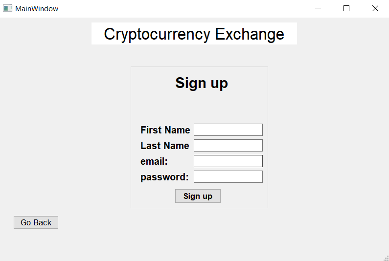

<h1 align="center">
  Cryptocurrency exchange:money_with_wings:
 </h1>
 
## Table of contents
* [About the project](#about-the-project)
* [Features](#features)
* [Plans for the future](#plans-for-the-future)

## About the project
Final project of Programming classes in fourth semester of Computer Science studies that simulates the behavior of the cryptocurrency exchange. 

The Project is written in the C++ language and uses Qt Creator Environment. It's not finished yet. I decided to download rates' data from last 3 years of the following cryptocurrencies:
* Bitcoin 
* Ethereum
* Binance Coin
* Tether
* Ripple 

## Features
1. ### Sign In

Sign in panel enables the user to log in to the exchange. If the user doesn't exist in the users' list or if he has entered incorrect data, he will see a proper message.

2. ### Sign Up

Sign up panel enables the user to create an account. If the user enters incorrect data, he will see a proper message. I am going to implement regular expression in that section.

3. ### Main Panel

In that panel, user can see multiple information like:
* Cryptocurrency graphs button 
* My Wallet button 
* Cryptocurrencies rates based on current day in the program
* Date information and *Change date* button

4. ### Change date

After choosing date to change and clicking correct button the date is changed. It automatically changes current rates in the table.

5. ### Cryptocurrency Graphs

The user can see graphs showing the rate for the last 30 days from the current date in program. This one shows Bitcoin rate.

6. ### My Wallt Panel

In this section the user can choose the functionality he is interested in from the presented above. He also can see current rates.

6. ### My Cryptocurrency

That section presents user's cryptocurrency in percenteges in the circle diagram. On the right, user sees the particular values of the cryptocurrencies.

7. ### Add money

After choosing that option a user can add any amount of money to the account.

8. ### Send Transfer

When a user wants to send a transfer, he has to enter the following information: recipent's email, the title, cryptocurrency and the amount of money.
If he doesn't have enough money or the recipent doesn't exist, he will get a proper message.

9. ### Transfers history

In that section the user sees history of sent and received transfers. One element presents information of the particular transfer. It shows the amount, the recipient/sender, the title and the date.

In addition, I am currently working on below features:
- Order and Orderbook mechanics that allow user to add several different orders known from popular exchanges. It also makes enables you to view the orders placed by the other users.
- CFD Mechanics. CFD is a shortcut of Contract from Difference. This option is quite risky, because a user can earn a lot of money but also lost everything. This mechanics allows user to bet if the cryptocurrency increses or not.

# Plans for the future
I am going to implement functionalities mentioned above but also work on the UI and UX. 

I hope you enjoy it, have a nice day! 
